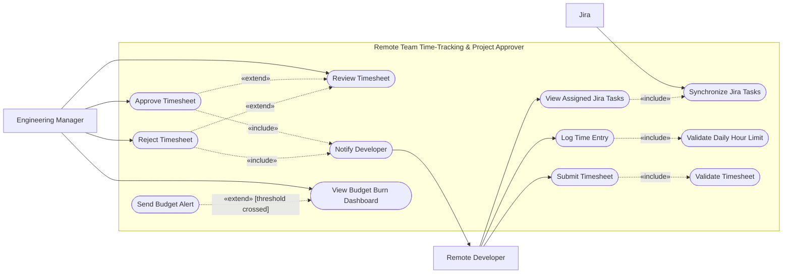

# Software Engineering Lab 1 - Requirements Engineering and UML Use-Case Modelling

**Problem Statement 46:** Remote Team Time-Tracking & Project Approver  
**Domain:** Developer Tools and IT Operations

## 1. Requirements Table

### Functional Requirements

| ID | Type | Description | Priority | Acceptance Criteria | Rationale |
|---|---|---|---|---|---|
| FR-001 | Functional - Jira task access | The system shall synchronize Jira tickets assigned to a remote developer and allow the developer to select an active ticket when creating a time entry. | High | **Pass:** An assigned active Jira ticket is retrieved and selectable with its key and summary; an unassigned or closed ticket is not selectable. **Fail:** A developer can log time against an unassigned or closed ticket. | Linking every entry to authorized project work improves traceability and prevents miscoding of effort. |
| FR-002 | Functional - Time entry | The system shall allow a developer to create, edit, and delete a draft time entry containing a work date, Jira ticket, duration, and work note, while preventing the developer's entries from exceeding 24 hours on any calendar day. | High | **Pass:** A valid entry is saved and an edit bringing the daily total to exactly 24 hours succeeds; an operation bringing it above 24 hours is rejected. **Fail:** A daily total above 24 hours is saved. | Accurate, bounded entries are the basis of trustworthy timesheets, budgets, and approvals. |
| FR-003 | Functional - Timesheet submission | The system shall allow a developer to submit a valid weekly draft timesheet to the responsible engineering manager and shall lock its entries until the manager rejects it. | High | **Pass:** A valid draft changes to **Submitted**, records its submission time and manager, and becomes read-only; an invalid draft remains editable and lists its errors. **Fail:** An invalid timesheet is submitted or a developer edits a submitted entry. | A controlled state transition gives managers a stable review record and prevents concurrent changes. |
| FR-004 | Functional - Approval workflow | The system shall allow the responsible engineering manager to review a submitted timesheet and approve it or reject it with a mandatory comment; it shall record the decision and notify the developer. | High | **Pass:** Approval changes the status to **Approved**; rejection without a comment is blocked; rejection with a comment changes it to **Rejected**, unlocks it, and notifies the developer. **Fail:** An unauthorized manager acts, an invalid transition occurs, or a rejection has no comment. | Auditable decisions and actionable feedback support accountability and timely correction. |
| FR-005 | Functional - Budget monitoring | The system shall calculate project labor cost from approved time, display the used amount, remaining amount, and burn percentage, and alert the manager when burn first reaches or crosses 80% or 100%. | Medium | **Pass:** A project with a budget of INR 100,000 and approved cost of INR 80,000 shows 80% used and INR 20,000 remaining and emits one 80% alert. **Fail:** Draft or rejected time affects actual cost, figures are incorrect, or a threshold creates duplicate alerts. | Early, accurate visibility lets managers correct overspend before it becomes irreversible. |

### Non-Functional Requirements

| ID | Type | Description | Priority | Acceptance Criteria | Rationale |
|---|---|---|---|---|---|
| NFR-001 | Performance | Under a simulated peak load of 200 concurrent users, 95% of time-entry saves, approval transitions, and dashboard refreshes shall complete within 500 ms and 99% within one second, measured at the server boundary over 30 minutes. | High | **Pass:** A 30-minute test with 200 concurrent users meets both percentile targets with an error rate below 1%. **Fail:** A percentile target is missed or the error rate is at least 1%. | Remote teams need responsive interactions, particularly around weekly submission deadlines. |
| NFR-002 | Security | The system shall enforce authenticated, role- and project-scoped access, use TLS 1.3 in transit and AES-256 or equivalent at rest, and retain immutable audit events for time-entry and approval changes for at least 365 days. | High | **Pass:** Tests prevent cross-user and cross-project access, reject plaintext transport, confirm encrypted storage, and verify immutable audit events containing actor, action, target, and timestamp. **Fail:** Unauthorized access succeeds or a required security control or audit event is absent. | Timesheets contain sensitive employee and financial information, while approvals require defensible audit history. |

## 2. Actors and Use Cases

### Actors

| Actor | Classification | Responsibility |
|---|---|---|
| Remote Developer | Primary actor | Views assigned work, records time, and submits weekly timesheets. |
| Engineering Manager | Primary actor | Reviews timesheets, approves or rejects them, and monitors project budget burn. |
| Jira | Secondary/supporting actor | Supplies assigned, active project tickets to the system. |

### Primary Use Cases

Primary use cases directly achieve a stakeholder's goal.

| ID | Use Case | Initiating Actor | Goal |
|---|---|---|---|
| UC-01 | View Assigned Jira Tasks | Remote Developer | Find an authorized task against which time can be recorded. |
| UC-02 | Log Time Entry | Remote Developer | Create or maintain a valid record of work performed. |
| UC-03 | Submit Timesheet | Remote Developer | Send a completed weekly timesheet for managerial approval. |
| UC-04 | Review Timesheet | Engineering Manager | Inspect submitted entries and decide their outcome. |
| UC-05 | View Budget Burn Dashboard | Engineering Manager | Monitor actual project cost and remaining budget. |

### Secondary Use Cases

Secondary use cases support, validate, specialize, or conditionally extend a primary use case.

| ID | Use Case | Relationship or Purpose |
|---|---|---|
| UC-06 | Synchronize Jira Tasks | Included when assigned Jira tasks are viewed. |
| UC-07 | Validate Daily Hour Limit | Included whenever a time entry is saved. |
| UC-08 | Validate Timesheet | Included whenever a timesheet is submitted. |
| UC-09 | Approve Timesheet | Extends review as one possible managerial decision. |
| UC-10 | Reject Timesheet | Extends review as an alternative managerial decision. |
| UC-11 | Notify Developer | Included after approval or rejection. |
| UC-12 | Send Budget Alert | Extends budget monitoring when a threshold is crossed. |

## 3. UML Use-Case Diagram

`«include»` represents mandatory reused behaviour. `«extend»` represents optional or conditional behaviour added to a complete base use case.

## 4. Use-Case Flow Specification

### UC-03 - Submit Timesheet for Approval

| Field | Specification |
|---|---|
| Scope | Remote Team Time-Tracking & Project Approver |
| Level | User goal |
| Primary actor | Remote Developer |
| Supporting actor | Engineering Manager |
| Trigger | The developer selects **Submit for Approval** for a weekly draft timesheet. |

#### Preconditions

1. The developer is authenticated and authorized for the project.
2. A draft timesheet exists for the selected work week.
3. A responsible engineering manager is assigned to the project.

#### Postconditions

**On success:** The timesheet has status **Submitted**; its entries are locked; the manager, submission timestamp, and audit event are recorded; and the manager is notified.

**On failure:** The timesheet remains **Draft**, no entries are locked, and no approval request is created.

#### Main Success Scenario

1. The developer opens the draft timesheet for the selected week.
2. The system displays its entries, daily and weekly totals, and assigned manager.
3. The developer selects **Submit for Approval**.
4. The system validates each entry's date, positive duration, work note, and active Jira ticket, and verifies that no daily total exceeds 24 hours.
5. The system asks the developer to confirm the weekly total and submission.
6. The developer confirms.
7. The system changes the status from **Draft** to **Submitted** and locks the entries.
8. The system records the developer, manager, and submission timestamp in the audit history.
9. The system sends an approval request to the assigned engineering manager.
10. The system displays the **Submitted** status and a confirmation to the developer.

#### Alternate Flow A1 - Validation Fails

This flow begins at Main Success Scenario step 4.

1. The system detects one or more invalid entries.
2. The system keeps the timesheet in **Draft** and does not create an approval request.
3. The system identifies every invalid entry and explains the required correction, such as a missing work note, inactive Jira ticket, or daily total above 24 hours.
4. The developer corrects the entries.
5. The flow resumes at Main Success Scenario step 3.
