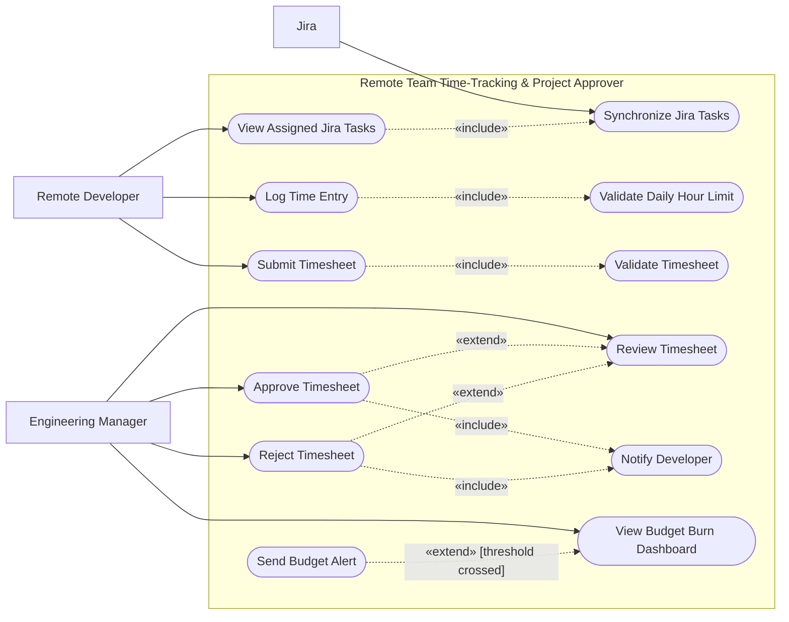

# UML Use-Case Diagram

The diagram models the two human stakeholders and Jira as a supporting external system. Solid arrows indicate actor participation; dotted labelled arrows indicate UML relationships.

The equivalent editable PlantUML source is in [use-case-diagram.puml](use-case-diagram.puml).

## Relationship rationale

- `Log Time Entry` always invokes `Validate Daily Hour Limit`, so `«include»` is used.
- `Submit Timesheet` always invokes `Validate Timesheet`, so `«include»` is used.
- Approval and rejection are alternative outcomes available while reviewing a submitted timesheet, so each `«extend»`s `Review Timesheet`.
- `Send Budget Alert` occurs conditionally when a threshold is crossed, so it `«extend»`s `View Budget Burn Dashboard`.
